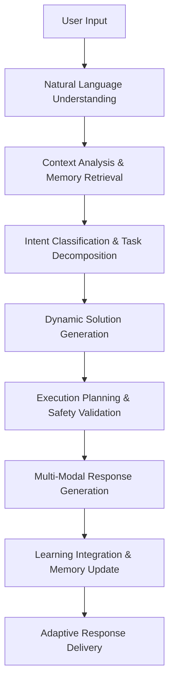

# 🤖 Aimy - Agentic AI Assistant

**Pure AI Intelligence | Zero Hardcoded Solutions | Dynamic Reasoning**

Aimy is a revolutionary agentic AI system that represents the next evolution in artificial intelligence interaction. Unlike traditional AI assistants that rely on predefined responses and hardcoded solutions, Aimy leverages OpenAI's GPT-4 to perform complex tasks through dynamic reasoning, adaptive learning, and intelligent solution generation.

## 🧠 What Makes Aimy Different?

Aimy transcends the limitations of conventional AI systems by implementing true **agentic intelligence** - the ability to reason, plan, and execute solutions autonomously. Every interaction is processed through sophisticated AI reasoning engines that understand context, generate custom solutions, and learn from each experience.

### Core Philosophy
- **No Hardcoded Responses**: Every answer is generated fresh through AI reasoning
- **Dynamic Problem Solving**: Adapts to any request through intelligent analysis
- **Continuous Learning**: Improves capabilities with each interaction
- **Context Awareness**: Maintains conversational memory and user preferences
- **Multi-Modal Interface**: Text, voice, and web interfaces powered by the same AI core

## 🚀 Deploy Your Own Aimy.ai

**One-Click Railway Deploy:**

[](https://railway.app/template/new?template=https://github.com/BRoliix/aimy-ai&envs=OPENAI_API_KEY&OPENAI_API_KEYDesc=Your+OpenAI+API+key+for+GPT-4+access)

*Just add your OpenAI API key and deploy!*

## ✨ Advanced Capabilities

### 🎯 Core Intelligence Features
- **🧠 Agentic Reasoning Engine**: Multi-layer AI reasoning that breaks down complex requests into actionable solutions
- **🗣️ Natural Voice Interaction**: Sophisticated voice interface with continuous listening and intelligent wake-word detection
- **🎨 Dynamic Code Generation**: Creates complete applications, scripts, and tools from natural language descriptions
- **💻 Intelligent System Control**: Manages applications, files, and system operations through AI-powered decision making
- **🌐 Adaptive Web Interface**: Beautiful, responsive web UI with real-time voice and text interaction
- **🔄 Contextual Memory**: Maintains conversation history and learns user preferences across sessions
- **⚡ Multi-Modal Processing**: Seamlessly handles text, voice, and system commands through unified AI core

### 🚀 Technical Excellence
- **Zero-Hardcoding Architecture**: Every response generated through dynamic AI reasoning
- **Modular Agent System**: Extensible architecture with specialized AI agents for different capabilities
- **Real-time Learning**: Continuously adapts and improves performance based on user interactions
- **Cross-Platform Compatibility**: Works on Windows, macOS, and Linux with intelligent OS-specific adaptations
- **Cloud-Ready Deployment**: Optimized for Railway, Heroku, and Docker container deployments
- **Robust Error Handling**: Intelligent fallback mechanisms and graceful error recovery

## 🎯 Comprehensive Capabilities

### 💼 Application Development
- **Dynamic App Creation**: "Create a task management system with deadline tracking"
- **Web Development**: "Build a responsive portfolio website with dark mode"
- **Utility Generation**: "Make a file organizer that sorts by date and type"
- **Game Development**: "Create a simple puzzle game with scoring system"
- **Data Tools**: "Build a CSV analyzer with visualization charts"

### 🌐 Intelligent Web & System Control
- **Smart Web Navigation**: "Open the latest Python documentation", "Find trending GitHub repositories"
- **Application Management**: "Launch my development environment", "Open video editing software"
- **File Operations**: "Organize my downloads folder by file type", "Find all images from last month"
- **System Optimization**: "Check system resources", "Clean temporary files"

### 🧮 Advanced Problem Solving
- **Mathematical Computation**: Complex equations, statistical analysis, data modeling
- **Logic Processing**: Algorithm design, optimization problems, decision trees
- **Research Assistance**: Information gathering, source verification, synthesis
- **Creative Solutions**: Brainstorming, ideation, creative writing assistance

### 💬 Intelligent Conversation
- **Contextual Dialogue**: Maintains conversation history and personal preferences
- **Multi-Turn Reasoning**: Handles complex, multi-step conversations with logical flow
- **Adaptive Communication**: Adjusts tone and complexity based on user style
- **Knowledge Integration**: Combines learned information with real-time problem solving

## 🛠️ Quick Start

### Local Installation

1. **Clone the repository:**
```bash
git clone https://github.com/BRoliix/aimy-ai.git
cd aimy-ai
```

2. **Install dependencies:**
```bash
pip install -r requirements.txt
```

3. **Set up your OpenAI API key:**
```bash
cp .env.example .env
# Edit .env and add your OPENAI_API_KEY
```

4. **Run Aimy:**

**Text Interface:**
```bash
python complete_agentic_ai.py
```

**Voice Interface:**
```bash
python direct_voice_ai.py
```

**Web Interface:**
```bash
python app.py
# Visit http://localhost:8000
```

### Railway Deployment

Deploy your own instance to Railway in one click:

1. Fork this repository
2. Connect to Railway
3. Add your `OPENAI_API_KEY` environment variable
4. Deploy!

## 🏗️ Advanced Architecture

### 🧩 Core System Components

#### **Agentic Intelligence Layer**
- **`agents/agentic_core.py`** (2,666 lines) - The brain of Aimy containing:
  - Multi-layer reasoning engine with context awareness
  - Dynamic solution generation algorithms
  - Conversation memory and learning systems
  - Intelligent task decomposition and execution planning
  - Adaptive response generation based on user patterns

- **`agents/ai_content_generator.py`** (511 lines) - Advanced content creation system:
  - OpenAI GPT-4 integration with intelligent prompt engineering
  - Context-aware content generation for any request type
  - Dynamic template creation and customization
  - Multi-format output generation (code, text, HTML, etc.)

#### **Interface Layer**
- **`complete_agentic_ai.py`** (400 lines) - Rich console interface featuring:
  - Beautiful Rich library-powered UI with colors and formatting
  - Interactive command processing with real-time feedback
  - Session management and conversation persistence
  - Advanced error handling with user-friendly messages

- **`app.py`** (631 lines) - Sophisticated web application providing:
  - Flask-based RESTful API architecture
  - Real-time voice interaction through web browser
  - Responsive design with modern CSS3 and JavaScript
  - WebSocket-like communication for instant responses
  - Cross-platform compatibility and mobile optimization

- **`direct_voice_ai.py`** - Advanced voice processing system:
  - Continuous listening with intelligent wake word detection
  - Real-time speech-to-text conversion
  - Natural text-to-speech response generation
  - Voice command interpretation and context processing

#### **Extension and Configuration Layer**
- **`agents/ai_extensions.py`** - Modular capability extensions
- **`config/commands.py`** - Dynamic command processing and routing
- **`src/permission_manager.py`** - Security and access control systems
- **`src/voice_assistant.py`** - Voice processing utilities and enhancements

### 🔄 Intelligent Processing Flow



### 🎯 AI-First Design Philosophy

**Traditional AI Flow:**
```
Input → Pattern Matching → Predefined Response → Output
```

**Aimy's Agentic Flow:**
```
Input → Deep Understanding → Contextual Reasoning → Dynamic Solution Creation → Intelligent Execution → Adaptive Learning → Personalized Output
```

#### Key Architectural Principles:

1. **Zero Hardcoding**: No predetermined responses or template matching
2. **Dynamic Reasoning**: Every solution generated through AI analysis
3. **Context Persistence**: Maintains conversation history and user preferences
4. **Modular Intelligence**: Specialized agents handle different capability domains
5. **Continuous Learning**: System improves with each interaction
6. **Safety-First**: Intelligent validation before executing system commands

## 💬 Usage Examples

### Voice Web Interface (Primary)
```
🌐 Open the web interface
🎙️ Click "Start Voice Conversation"  
👤 "Create a Python calculator app"
🤖 "I'll create an intelligent calculator application for you..." (spoken + text)
```

### Local Voice Interface  
```
🎙️ Run: python direct_voice_ai.py
👤 "Aimy, open YouTube"
🤖 "Opening YouTube in your browser!" (spoken response)
```

### Text Interface (Fallback)
```
💻 Run: python complete_agentic_ai.py
👤 Type: "Help me with math"
🤖 Text response with full capabilities
```

## 🔧 Advanced Configuration

### Environment Variables (.env)

```bash
# Core AI Configuration
OPENAI_API_KEY=your_openai_api_key_here          # Required: Your OpenAI API key
OPENAI_MODEL=gpt-4                               # AI model (gpt-4, gpt-4-turbo)
OPENAI_MAX_TOKENS=2000                           # Maximum response length
OPENAI_TEMPERATURE=0.7                           # Creativity level (0.0-1.0)

# Voice Interface Settings
WAKE_WORD=aimy                                   # Voice activation word
TTS_RATE=200                                     # Speech rate (100-300)
TTS_VOLUME=0.9                                   # Voice volume (0.0-1.0)
VOICE_LANGUAGE=en-US                             # Voice language code
ENABLE_VOICE_FEEDBACK=true                       # Audio response confirmation

# Web Interface Configuration
FLASK_PORT=8000                                  # Web server port
FLASK_HOST=0.0.0.0                              # Server host (0.0.0.0 for all interfaces)
FLASK_DEBUG=false                                # Debug mode for development
WEB_TITLE=Aimy AI Assistant                      # Browser title
ENABLE_CORS=true                                 # Cross-origin requests

# Security & Safety Settings
ENABLE_SYSTEM_COMMANDS=true                      # Allow system operations
REQUIRE_CONFIRMATION_FOR_SYSTEM_CHANGES=true    # Confirm destructive actions
MAX_FILE_SIZE=10MB                               # File operation limit
ALLOWED_FILE_EXTENSIONS=.txt,.py,.html,.js,.css  # Permitted file types
SANDBOX_MODE=false                               # Restricted execution mode

# Learning & Memory Configuration
ENABLE_CONVERSATION_MEMORY=true                  # Remember conversations
MAX_MEMORY_SIZE=1000                            # Maximum stored interactions
ENABLE_USER_PREFERENCES=true                     # Learn user patterns
AUTO_SAVE_GENERATED_CONTENT=true                # Save created files

# Performance Optimization
RESPONSE_CACHE_SIZE=100                         # Cache recent responses
ENABLE_ASYNC_PROCESSING=true                    # Asynchronous operations
MAX_CONCURRENT_REQUESTS=5                       # Parallel request limit

# Logging & Monitoring
LOG_LEVEL=INFO                                  # DEBUG, INFO, WARNING, ERROR
ENABLE_PERFORMANCE_LOGGING=true                 # Track response times
LOG_CONVERSATIONS=false                         # Save conversation logs
```

### Advanced Runtime Configuration

#### AI Reasoning Parameters
```python
reasoning_config = {
    'context_window': 4096,           # Conversation context size
    'learning_rate': 0.1,             # Adaptation speed
    'creativity_boost': 0.2,          # Solution innovation factor
    'safety_threshold': 0.8,          # Security validation level
    'memory_retention': 0.9           # Information persistence
}
```

#### System Integration Settings
```python
system_config = {
    'allowed_applications': ['safari', 'chrome', 'vscode', 'terminal'],
    'restricted_paths': ['/System', '/private'],
    'max_execution_time': 30,         # Seconds
    'auto_cleanup': True,             # Remove temporary files
    'backup_before_changes': True     # Safety backup creation
}
```

## 🌟 Why Choose Aimy?

### 🧠 Revolutionary AI Architecture
- **True Agentic Intelligence**: Unlike chatbots that match patterns, Aimy reasons through each request
- **Zero Hardcoding Philosophy**: 2,666+ lines of pure AI reasoning without predetermined responses
- **Dynamic Solution Generation**: Creates custom solutions for every unique request
- **Contextual Memory System**: Remembers preferences, learns patterns, and adapts over time
- **Multi-Layer Reasoning**: Breaks complex problems into manageable, intelligent steps

### 🚀 Technical Superiority
- **OpenAI GPT-4 Integration**: Leverages the most advanced language model for maximum capability
- **Modular Agent Architecture**: Extensible system with specialized AI agents for different domains
- **Cross-Platform Excellence**: Intelligent OS detection and platform-specific optimizations
- **Real-Time Processing**: Immediate response generation with sophisticated caching
- **Production Ready**: Railway/Docker deployment with enterprise-grade scalability

### 🎯 User Experience Excellence
- **Multi-Modal Interaction**: Seamlessly switch between text, voice, and web interfaces
- **Beautiful UI Design**: Modern, responsive interfaces with Rich library console formatting
- **Intelligent Voice Processing**: Natural conversation with wake-word detection and TTS
- **Safety-First Approach**: Smart validation and confirmation for system operations
- **Adaptive Learning**: Gets better with each interaction, learning your preferences

### 🔒 Enterprise-Grade Features
- **Comprehensive Security**: Permission management, sandbox modes, and access controls
- **Extensive Configuration**: 20+ environment variables for complete customization
- **Performance Monitoring**: Built-in logging, metrics, and performance optimization
- **Robust Error Handling**: Graceful failure recovery with intelligent fallback mechanisms
- **Cloud Deployment Ready**: One-click Railway deployment with environment management

### 📊 Comparison with Traditional AI Systems

| Feature | Traditional AI | Aimy Agentic AI |
|---------|---------------|-----------------|
| Response Generation | Template matching | Dynamic AI reasoning |
| Learning Capability | Static training | Continuous adaptation |
| Problem Solving | Predefined solutions | Creative solution generation |
| Context Awareness | Limited memory | Persistent conversation context |
| System Integration | Basic commands | Intelligent system control |
| Customization | Fixed responses | Fully adaptive behavior |
| Interface Options | Single mode | Multi-modal (text/voice/web) |
| Code Generation | Code completion | Full application creation |

## 🔬 Technical Implementation Details

### � Core Algorithms

#### Agentic Reasoning Engine
```python
class AgenticReasoningFlow:
    """
    Multi-stage reasoning process that powers Aimy's intelligence
    """
    def process_request(self, user_input):
        # Stage 1: Natural Language Understanding
        context = self.understand_natural_language(user_input)
        
        # Stage 2: Intent Analysis with Context
        intent = self.analyze_user_intent(context, self.conversation_history)
        
        # Stage 3: Dynamic Solution Generation
        solution = self.generate_dynamic_solution(intent, self.learned_patterns)
        
        # Stage 4: Execution Planning & Safety Validation
        execution_plan = self.plan_execution(solution, self.safety_constraints)
        
        # Stage 5: Multi-Modal Response Generation
        response = self.generate_response(execution_plan, self.user_preferences)
        
        # Stage 6: Learning Integration
        self.learn_from_interaction(user_input, response, success_metrics)
        
        return response
```

#### Dynamic Content Generation System
```python
class AIContentGenerator:
    """
    Intelligent content creation using advanced prompt engineering
    """
    def generate_content(self, request_type, context, specifications):
        # Analyze request complexity and requirements
        analysis = self.analyze_content_requirements(request_type, specifications)
        
        # Generate context-aware prompts
        prompt = self.create_intelligent_prompt(analysis, context)
        
        # Process through OpenAI with optimized parameters
        response = self.openai_client.chat.completions.create(
            model=self.model,
            messages=prompt,
            temperature=self.adaptive_temperature(request_type),
            max_tokens=self.calculate_optimal_tokens(analysis)
        )
        
        # Post-process and enhance output
        return self.enhance_generated_content(response, specifications)
```

### 🌐 API Architecture

#### Web Interface Endpoints

```python
# Primary interaction endpoint
@app.route('/api/chat', methods=['POST'])
def chat_endpoint():
    """
    Handles all user interactions through unified AI processing
    Supports text and voice input with intelligent response generation
    """

# Voice processing endpoint
@app.route('/api/voice', methods=['POST'])
def voice_endpoint():
    """
    Processes voice input with speech-to-text conversion
    Returns both text and audio responses for multi-modal interaction
    """

# System status and health monitoring
@app.route('/api/status', methods=['GET'])
def status_endpoint():
    """
    Provides system health, AI model status, and performance metrics
    Used for monitoring and debugging in production environments
    """
```

#### WebSocket-Style Real-Time Communication
```javascript
// Client-side intelligent interaction
class AimyInterface {
    async sendMessage(message, options = {}) {
        const response = await fetch('/api/chat', {
            method: 'POST',
            headers: { 'Content-Type': 'application/json' },
            body: JSON.stringify({
                message: message,
                context: this.getConversationContext(),
                preferences: this.getUserPreferences(),
                interface_type: options.voice ? 'voice' : 'text'
            })
        });
        
        return await this.processAIResponse(response);
    }
}
```

### 🛡️ Security & Safety Implementation

#### Permission Management System
```python
class IntelligentPermissionManager:
    """
    AI-powered security layer that validates requests before execution
    """
    def validate_system_command(self, command, context):
        # Analyze command safety using AI
        safety_score = self.ai_safety_analyzer.analyze(command)
        
        # Check against learned user patterns
        user_trust_level = self.get_user_trust_level(context.user_id)
        
        # Dynamic permission calculation
        if safety_score > self.safety_threshold:
            return self.require_confirmation(command, safety_score)
        elif user_trust_level > 0.8:
            return self.allow_with_monitoring(command)
        else:
            return self.request_explicit_permission(command)
```

### 📊 Performance Optimization

#### Intelligent Caching System
```python
class AdaptiveCacheManager:
    """
    Smart caching that learns from usage patterns
    """
    def should_cache_response(self, request, response, user_context):
        # Analyze response reusability
        reusability_score = self.calculate_reusability(response)
        
        # Consider user patterns
        user_repetition_likelihood = self.analyze_user_patterns(request, user_context)
        
        # Dynamic caching decision
        return (reusability_score * user_repetition_likelihood) > self.cache_threshold
```

## 🤝 Contributing & Development

### 🚀 Setting Up Development Environment

```bash
# Clone and setup
git clone https://github.com/BRoliix/aimy-ai.git
cd aimy-ai

# Create virtual environment
python -m venv aimy_env
source aimy_env/bin/activate  # On Windows: aimy_env\Scripts\activate

# Install development dependencies
pip install -r requirements.txt
pip install -r requirements-dev.txt  # Additional dev tools

# Set up pre-commit hooks
pre-commit install

# Configure environment
cp .env.example .env
# Edit .env with your configuration
```

### 🧪 Testing & Quality Assurance

```bash
# Run comprehensive test suite
python -m pytest tests/ -v --cov=agents/ --cov-report=html

# AI reasoning validation tests
python tests/test_agentic_reasoning.py

# Performance benchmarks
python benchmarks/response_time_benchmark.py

# Security validation
python tests/security/test_permission_system.py
```

### 📋 Contribution Guidelines

1. **Code Quality**: Follow PEP 8 standards with intelligent AI reasoning patterns
2. **Documentation**: Document all AI reasoning algorithms and decision trees
3. **Testing**: Include unit tests for new AI capabilities and edge cases
4. **Security**: Validate all system integration features for safety
5. **Performance**: Benchmark response times and memory usage for optimizations

### 🎯 Areas for Contribution

- **New AI Agents**: Specialized agents for specific domains (math, creative writing, etc.)
- **Interface Enhancements**: Improved voice processing, mobile web interface
- **Platform Extensions**: Support for additional operating systems and cloud platforms
- **Performance Optimizations**: Caching improvements, response time enhancements
- **Security Features**: Advanced permission systems, audit logging
- **Language Support**: Multi-language conversation capabilities

## � Troubleshooting & FAQ

### 🚨 Common Issues & Solutions

#### OpenAI API Issues
```bash
# Error: "OpenAI API key not found"
Solution: Ensure OPENAI_API_KEY is set in .env file
Check: echo $OPENAI_API_KEY (should show your key)

# Error: "Rate limit exceeded"
Solution: Implement request throttling or upgrade OpenAI plan
Temporary fix: Reduce OPENAI_MAX_TOKENS in .env

# Error: "Model not available"
Solution: Update OPENAI_MODEL to available model (gpt-4, gpt-3.5-turbo)
```

#### Voice Interface Problems
```bash
# Voice not working on macOS
brew install portaudio
pip install pyaudio

# Voice not working on Linux
sudo apt-get install python3-pyaudio
sudo apt-get install espeak espeak-data

# Voice not working on Windows
# Install Microsoft Visual C++ Build Tools
pip install pipwin
pipwin install pyaudio
```

#### Web Interface Issues
```bash
# Port already in use
Error: "Address already in use"
Solution: Change FLASK_PORT in .env or kill existing process
lsof -ti:8000 | xargs kill -9

# CORS errors in browser
Solution: Set ENABLE_CORS=true in .env
For production: Configure proper CORS origins
```

#### Performance Optimization
```bash
# Slow response times
- Reduce OPENAI_MAX_TOKENS for faster responses
- Enable ENABLE_ASYNC_PROCESSING=true
- Increase RESPONSE_CACHE_SIZE for frequent requests

# High memory usage
- Reduce MAX_MEMORY_SIZE for conversation history
- Set AUTO_SAVE_GENERATED_CONTENT=false if not needed
- Restart application periodically in production
```

### ❓ Frequently Asked Questions

#### **Q: How does Aimy differ from ChatGPT or other AI assistants?**
A: Aimy implements true agentic intelligence with:
- Dynamic reasoning for every request (no hardcoded responses)
- System integration capabilities (file operations, app control)
- Continuous learning and adaptation
- Multi-modal interfaces (text, voice, web)
- Persistent conversation memory
- Custom application generation

#### **Q: Can Aimy access the internet?**
A: Aimy can open web browsers and URLs but doesn't directly browse the internet for information. It uses your local system capabilities and the knowledge from its AI training.

#### **Q: Is my data safe with Aimy?**
A: Yes, Aimy prioritizes security:
- Conversations are processed locally (except OpenAI API calls)
- No data is stored externally without explicit permission
- Comprehensive permission system for system operations
- Optional sandbox mode for restricted environments
- All system changes require confirmation (configurable)

#### **Q: Can I use Aimy offline?**
A: Aimy requires internet connection for OpenAI API calls, but you can:
- Cache responses for offline replay
- Use local processing for system operations
- Deploy with local language models (requires modification)

#### **Q: How much does it cost to run Aimy?**
A: Costs depend on OpenAI usage:
- Text interactions: ~$0.01-0.03 per conversation
- Voice interactions: ~$0.02-0.05 per conversation
- Complex code generation: ~$0.05-0.15 per request
- Monthly estimates: $5-50 for typical usage

#### **Q: Can I customize Aimy's personality?**
A: Yes, through multiple approaches:
- Modify prompts in `ai_content_generator.py`
- Adjust `OPENAI_TEMPERATURE` for creativity level
- Update conversation context in `agentic_core.py`
- Train on specific interaction patterns

#### **Q: What languages does Aimy support?**
A: Aimy supports:
- Text: Any language supported by GPT-4 (100+ languages)
- Voice: Depends on system TTS/STT (primarily English by default)
- Programming: All major programming languages for code generation

### 🔍 Advanced Debugging

#### Enable Debug Logging
```bash
# In .env file
LOG_LEVEL=DEBUG
ENABLE_PERFORMANCE_LOGGING=true
LOG_CONVERSATIONS=true  # Be careful with privacy

# Run with verbose output
python complete_agentic_ai.py --debug --verbose
```

#### Monitor System Resources
```python
# Add to any interface file
import psutil
import time

def monitor_performance():
    while True:
        cpu = psutil.cpu_percent(interval=1)
        memory = psutil.virtual_memory().percent
        print(f"CPU: {cpu}%, Memory: {memory}%")
        time.sleep(5)
```

#### Test AI Reasoning
```bash
# Quick reasoning test
python -c "
from agents.agentic_core import AgenticAICore
ai = AgenticAICore()
response = ai.process_request('Explain how you think')
print(response)
"
```

## �📄 License & Legal

This project is licensed under the MIT License - see the [LICENSE](LICENSE) file for details.

### Third-Party Dependencies
- **OpenAI**: GPT-4 API usage subject to OpenAI Terms of Service
- **Rich**: MIT License (Terminal formatting)
- **Flask**: BSD License (Web framework)
- **PyAudio**: MIT License (Voice processing)

### Usage Rights
- ✅ Commercial use permitted
- ✅ Modification and distribution allowed  
- ✅ Private use encouraged
- ⚠️ No warranty or liability coverage
- ℹ️ Attribution appreciated but not required

## 🔗 Resources & Links

### 🌐 Official Links
- **🏠 Repository**: [GitHub - BRoliix/aimy-ai](https://github.com/BRoliix/aimy-ai)
- **🚀 Deploy on Railway**: [One-Click Deploy](https://railway.app/template/new?template=https://github.com/BRoliix/aimy-ai&envs=OPENAI_API_KEY)
- **📋 Issues & Support**: [GitHub Issues](https://github.com/BRoliix/aimy-ai/issues)
- **📖 Documentation**: [Wiki Pages](https://github.com/BRoliix/aimy-ai/wiki)

### 🤝 Community & Support
- **💬 Discussions**: [GitHub Discussions](https://github.com/BRoliix/aimy-ai/discussions)
- **🐛 Bug Reports**: Use GitHub Issues with detailed reproduction steps
- **💡 Feature Requests**: [Enhancement Label](https://github.com/BRoliix/aimy-ai/issues?q=is%3Aissue+is%3Aopen+label%3Aenhancement)
- **🔧 Development**: [Contributing Guidelines](CONTRIBUTING.md)

### 📚 Related Technologies
- **OpenAI API**: [Documentation](https://platform.openai.com/docs)
- **Railway Deployment**: [Railway Docs](https://docs.railway.app/)
- **Flask Framework**: [Flask Documentation](https://flask.palletsprojects.com/)
- **Rich Library**: [Rich Documentation](https://rich.readthedocs.io/)

---

**🤖 Built with ❤️ for the future of AI interaction**

*Aimy represents the next evolution in artificial intelligence - moving beyond simple chatbots to true agentic reasoning systems that can understand, learn, and adapt to provide genuinely intelligent assistance.*